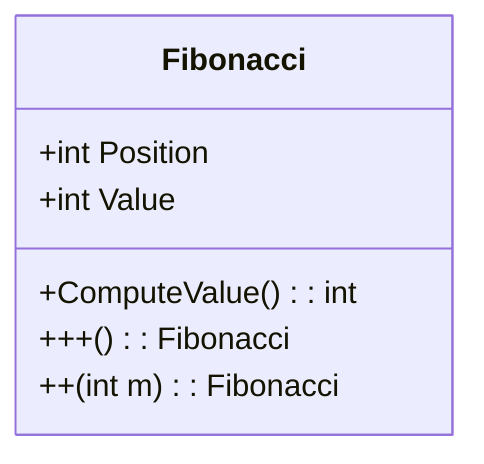
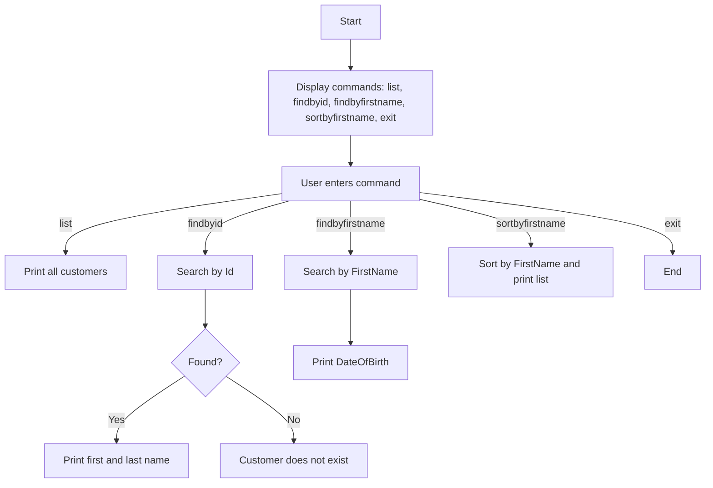

⸻

# Assignment 2 – Design Documentation

⸻

## Q1 – Customer LINQ Mini App

### Class Diagram

### Flowchart

⸻

Q2 – Items Join (LINQ)

Data Structure

ItemName
	•	Properties:
	•	Id : int
	•	Iname : string
	•	SNo : int

ItemPrice
	•	Properties:
	•	Id : int
	•	Price : double

Flowchart

Start
  |
Load ItemName and ItemPrice lists
  |
Join lists on Id
  |
Print all items with prices
  |
Prompt user to enter item name
  |
Lookup price and print
  |
End

⸻

Q3 – Fibonacci + Operator Overloading

Class Diagram

Fibonacci
	•	Properties:
	•	Position : int
	•	Value : int
	•	Methods / Operators:
	•	ComputeValue() : int
	•	++() : Fibonacci   (next Fibonacci)
	•	+(int m) : Fibonacci   (advance m positions)

Flowchart

Start
  |
Prompt user for n
  |
Compute F(n)
  |
Apply ++ operator -> F(n+1)
  |
Apply +m operator -> F(n+m)
  |
Print results
  |
End

⸻

Q4 – File Copy

Flowchart

Start
  |
Prompt for source file path
  |
Check if file exists?
  |--- No ---> Print error, End
  |--- Yes ---> Prompt for destination file path
                   |
                   Copy file content
                   |
                   Print success message
                   |
End

⸻

Notes:
	•	Use this as-is in a Markdown file (Design.md) for your _design folder.
	•	ASCII diagrams ensure that it will render correctly in any Markdown viewer, even without Mermaid.
	•	Each Q folder (Q1–Q4) can reference these diagrams in your submission.

⸻

