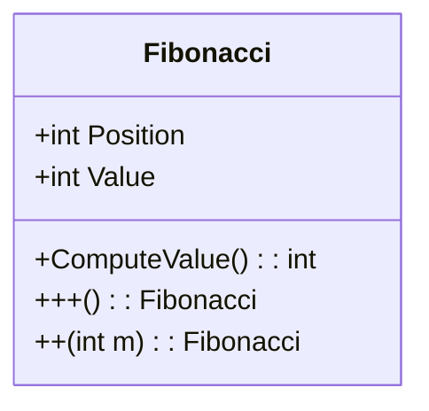
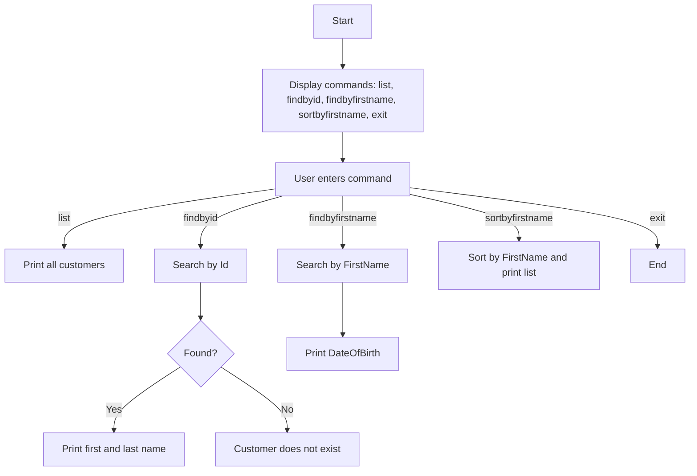
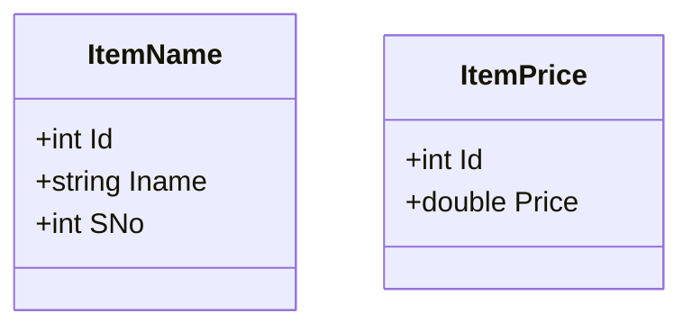
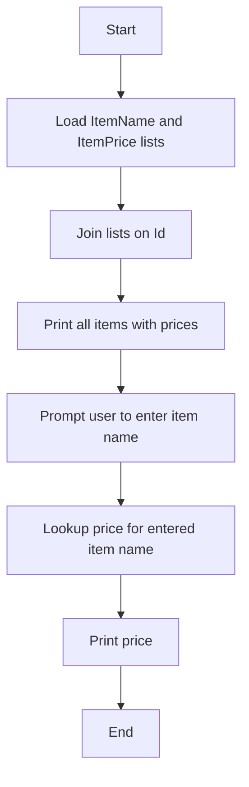
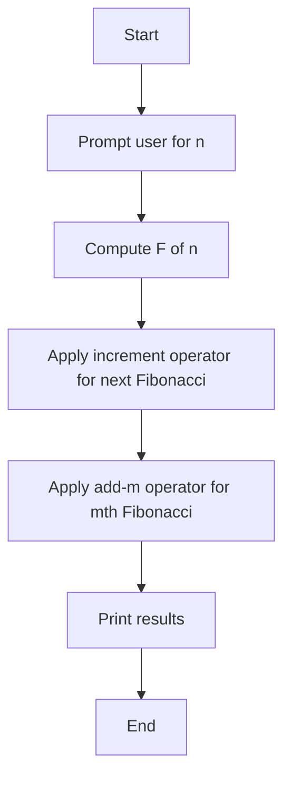
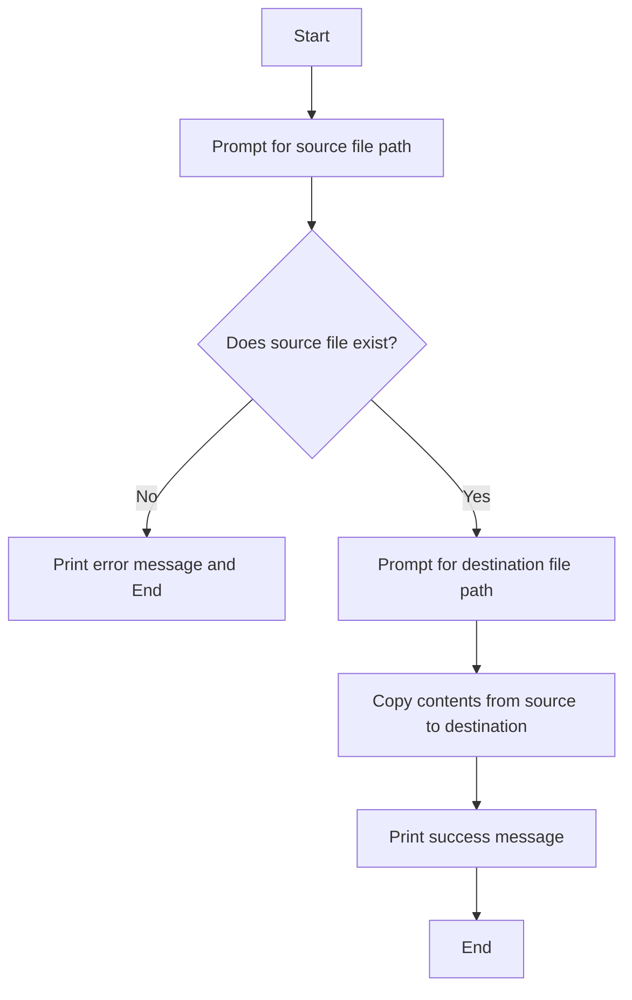

# Assignment 2 – Design Documentation
by Marc Cavada

⸻
⸻

## Q1 – Customer LINQ Mini App

### Class Diagram

### Flowchart

⸻
## Q2 – Customer LINQ Mini App

### Class Diagram

### Flowchart

⸻
## Q3 – Fibonacci with Operator Overloading

### Class Diagram

### Flowchart

⸻
## Q4 – File Copy

### Flowchart

